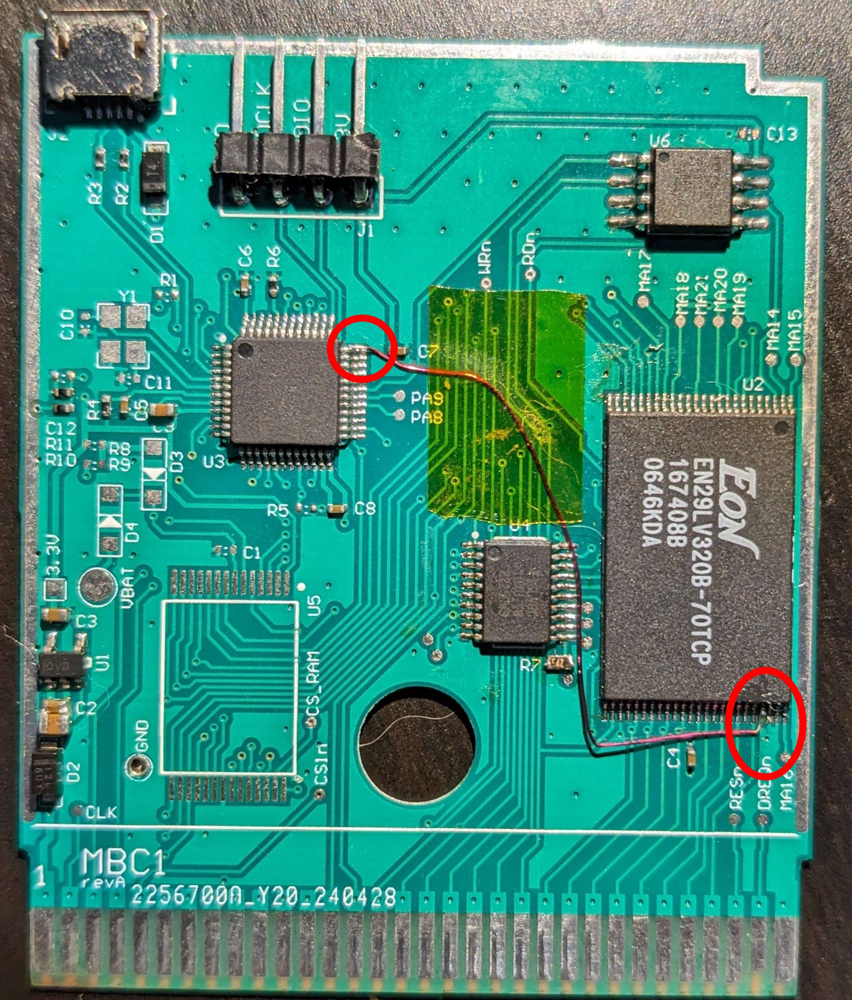

# GameBoy USB Cartridge

## Project Overview

Welcome to the GameBoy USB Cartridge project! This project aims to replicate a classic GameBoy cartridge and enhance it by adding a USB interface. This modification allows users to change the ROM content of the cartridge via a USB connection, making it a versatile and modern tool for GameBoy enthusiasts, developers, and collectors.

## Features

- **Classic GameBoy Cartridge Design**: Faithfully replicates the original cartridge's form factor and functionality.
- **USB Interface**: Enables easy ROM updates and data transfer through a USB connection.
- **Custom ROM Support**: Upload and play custom ROMs without the need for additional hardware.
- **Open Source**: Fully open-source hardware and software design, encouraging community contributions and modifications.

## Table of Contents

1. [Getting Started](#getting-started)
1. [Hardware Requirements](#hardware-requirements)
1. [Software Requirements](#software-requirements)
1. [Installation](#installation)
1. [Usage](#usage)
1. [Final notes](#final-notes)
1. [License](#license)

## Getting Started

GameBoy USB Cartridge is a diy project, so a custom pcb must be ordered and assembled.
I consider this project as dificult, since it requires the soldering of very fine pitch components
and requires good knowledge electronics and microcontroller wolkings in case of debug.

### Prerequisites

Ensure you have the following components and tools:

- GameBoy or GameBoy Color console
- Access to 3D printer for printing cartridge shell.
- Soldering tools and supplies
- Required hardware for Afterburrner gal programmer
- Jtag harware tool with SWD support

## Hardware Requirements

- **USB Cartridge pcb**: A bare pcb from your favorite pcb manufacturer (see hardware folder for schematic and gerber files)
- **Components**: Parts to populate pcb (see bom file on hardware folder)

## Software Requirements

- **Firmware Development**: Arm GNU Toolchain from arm Develop.
- **Afterburner pal programming**:  https://github.com/ole00/afterburner
- **Jtag software**: Can be Jlink or Openocd

## Installation

### Hardware Assembly

- Follow available schematic and assembly files.
- **Apply correction**: PCB has an error, in which the address line A0 is not connected to the correct pin of nor flash memory.
The workaround is connect a thin wire between pin 45 (Q15/A-1) to micro controller pin 36 (PF7).
- **Print 3D Case**: check cad files under hardware/case folder

### Firmware Upload

#### Programming pal

A JED file is provided for programming the pal, for his step I have used a modified version of Afterburner for Arduino with custom
hardware on a breadboard, but recommend using an Arduino with Afterburner.

The pal source file is also avaialble *mbc1.pld* and can be compiled with Wincupl, it is possible to compile a version that supports ram
but is limits the rom size and it has not been tested.

#### Programming microcontroller

To build microcontroller firmare, install Toolchain (I have used gcc version 10.3.1) and run *make* command.
If build is successful, *usb-cartridge.elf* will be available on *build* folder, use your jtag tool to program microcontroller.

## Usage

If all goes well with hardware and firmware, connecting USB Cartridge to a pc a serial device should be detected.
Also an unformated usb drive should be detected, format it as FAT.

Copy a rom file to that drive, the maximum rom size is 256kB, open a serial terminal and run commands:

1. `*mount 1*` this command mounts volume inside microcontroller.
1. `*list*`     list available files.
1. `*rom program <romname>*` programs given rom file into flash.

There are several other commands, typing *help* list all avaialble commands, typing some commands without parameters prints help of that command.
Code can be also checked for more command information.

Filally insert the cartrige and enjoy!

## Final notes

As mentioned this is a dificult project that requires good knowledge in electronics, since there is a lot of information that is 
omitted or not documented. One example is the flash memory support, I have used devices that were available to me and written drivers 
for them, it is very unlikely that the same parts will be available to other persons.
Firmware was written having that assumption in mind and flash driver is implemented in a way that should be easy to add new flash devices
or port it to other microcontroller.

If a new HW revision is drawn that fixes the error on address lines, firmware should also be udated in order to remove implemented workaround.

On mechanical side the 3D model for the case does not have an opening for USB connector, FreeCad project is available to be modified or a simple x-acto knife can be used to cut the opening.

## License

This project is licensed under the MIT License - see the [LICENSE](LICENSE) file for details.

---

Thank you for your interest in the GameBoy USB Cartridge project! We hope you enjoy building and using this modern take on a classic gaming accessory. If you have any questions or need assistance, please feel free to open an issue in the repository.
